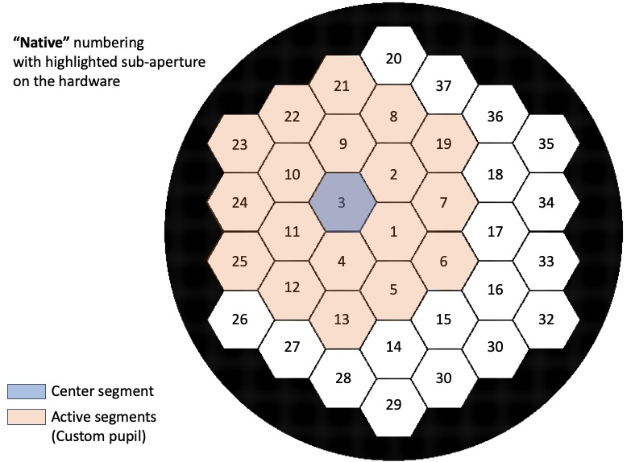
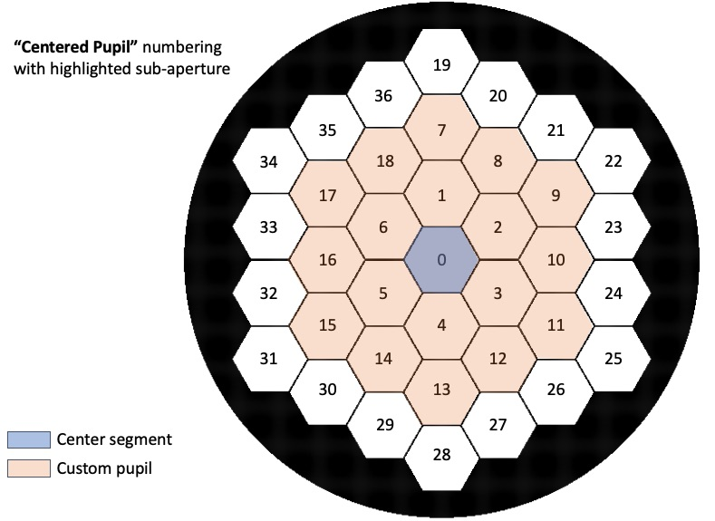

# Iris AO

If you have an Iris AO segmented DM, congratulations! You are one of only a few.

## Segment numbering and input formats

There are only two allowed mappings for the input formats, Native and Centered Pupil.

_Native_:
This numbering is tied directly to the Iris AO numbering. In this frame, the center of the hardware is 1 and the numbering continues up and **counter-clockwise**. Any input in this numbering means that the piston, tip, tilt, values correspond directly to the segment number given. Segment values input in this frame will not be shifted, only cropped if you are only using a sub-aperture of the DM. Even if you are only using a sub-aperture, the numbers of the segments will not change. For example: If you are using a sub-aperture that is centered on segment 3, the code will pull the values for segment 3 from the input and use that as your center segment value. See figure below.

_Centered Pupil_:
This numbering system starts in the center of your pupil, regardless of where it is in the DM, continues up and **clockwise**. This the default numbering for POPPY and also intuitive for someone starting from an array. As an example, if you are using a sup-aperture of the DM start starts at segment 3 (same as in the example above), in the input, segment 0 will actually corresponds to segment 3 on the DM and the input will be shifted accordingly. See figure below.

For each of the input formats, we give, in brackets, the default/expected numbering for each base on the above options.

## Input formats

The `catkit` module for the Iris AO expects that you will be passing in one of the following types:

* *.PTT111* file: File format of the command coming out of the IrisAO GUI [Native]

  Example:

        [GV: 0, 0, 0]
        [MV: 0, 0]
        [MV: 1, 0]
        ...
        [MV: 20, 0]
        [ZV: 1, 0.01, 0, 0]
        [ZV: 2, 0, 0.6, 0]
        ...
        [ZV: 37, 0, 0, 0]

* *.ini* file: File format of command that gets sent to the IrisAO controls [Native]
* dictionary: Same format that gets returned: {segment number: (piston, tip, tilt)} [Centered Pupil]

Each of these types has to be handled slightly differently, but never fear, we figured that out for you!

We have also included here some util functions that might come in handy and a module for creating your own custom command with POPPY.

## Using the IrisAO controller

As with the other hardware in `catkit`, you can open and close a connection to the Iris AO as a context manager.

Note that catkit.hardware.iris_ao.segmented_dm_command and catkit.hardware.iris_ao.util pull from CONFIG_INI any time you use either one, so you must import your local CONFIG_INI at the top of your module even if you do not explicitly use it in that module, this will ensure that you are grabbing the correct parameters for *your* testbed.

### Example:
If putting *only* the flat map on the Iris AO:

    from catkit.hardware.iris_ao.segmented_dm_command import load_command

    with testbed.segmented_dm() as iris:
        iris_command = load_command(None, flat_map=True)
        iris.apply_shape(iris_command)

## `config.ini` additions

Note that if you have an Iris AO segmented DM, you will need to add an "iris_ao" section to
your config.ini file:

* `mirror_serial`: The mirror serial number. This corresponds to a .mcf file that *MUST* include the driver serial number under "Smart Driver". See Important Note below.
* `driver_serial`: The driver serial number. This corresponds to a .dcf file.
* `total_number_of_segments`: The number of segments in your Iris AO DM (including any non-functioning segments).
* `active_number_of_segments`: (Optional) The number of segments in your specific pupil (for most, this is less than `total_number_of_segments`).
* `active_segment_list`: (Optional) This parameter only needs to be provided if `active_number_of_segments` is less than `total_number_of_segments`. This will be a list of the segment numbers associated with the segments that are used in your pupil. The first segment is the center segment, then the following segments are in order from "up" to the next ring, and then counter clockwise. Note that "up" for the Iris hardware is in the direction of segment number 20. For example, if your pupil is centered on segment 3 and is only one ring, then active_segment_list = [3, 9, 10, 11, 4, 1, 2]

* `flat_file_ini`: The location of the custom flat .ini file for your Iris AO DM.  
* `config_ptt_file`: The location of the ConfigPTT.ini file which is the file that contains whatever command you want to put on the DM.
* `path_to_dm_ex`: The path to the directory that houses the DM_Control.exe file
* `full_path_dm_exe`: The path to (and including) the DM_Control.exe file

Optional (if using POPPY, you will need these - they should be the same for all IrisAO DMs):

* `flat_to_flat_mm`: The flat side to flat side diameter of each segment in units of mm
* `gap_um`: The size of the gap between segments in units of um
* `include_outer_ring_corners`: (Optional) This is a bool that will indicate if the corner segments of the outer ring of you aperture will be used. For example, for LUVIOR A- or B-like apertures, this parameter would be false, but for a JWST- or Keck-like aperture it is true.

---
**Important Note**:

Each segmented DM from Iris AO was calibrated with a specific driver(s). This calibration is captured in the .mcf file. Mixing a .mcf file with a .dcf file that *does not match* the driver serial number in the .mcf file could be *fatal* to your DM.

***Make sure the mirror and driver serial numbers are correct in your config.ini file.***

---

### Example:

    [iris_ao]

    mirror_serial = 'PWA##-##-##-####'
    driver_serial = '########'
    total_number_of_segments = 37
    active_number_of_segments = 19
    active_segment_list = [3, 9, 10, 11, 4, 1, 2, 21, 22, 23, 24, 25, 12, 13, 5, 6, 7, 19, 8]
    flat_to_flat_mm = 1.4
    gap_um = 10
    flat_file_ini = ${optics_lab:local_repo_path}/DM/MirrorControlFiles/CustomFLAT.ini
    config_ptt_file = ${optics_lab:local_repo_path}/DM/MirrorControlFiles/ConfigPTT.ini
    path_to_dm_exe = ${optics_lab:local_repo_path}Control DM/Code/release

Note that the code expects to find `DM_Control.exe` in `path_to_dm_exe`.

## Update your `testbed_state.py` file
The `iris_ao_controller` will update your `testbed_state.py` file with the current command being applied to the Iris AO. In order to do this, you will need to add the following to your file:

    # IrisAO command object currently being applied.
    iris_command_object = None

When there is no command on the the Iris AO, this variable will be changed back to `None`.

## Update your `testbed.py` file
You also want to make sure you can open and close your Iris AO like other hardware, as a context manager.

    from catkit.hardware.iris_ao.iris_ao_controller import IrisAoDmController # Iris AO

    def segmented_dm_controller():
        """
        Proper way to control the segmented deformable mirror controller. Using this function
        keeps the scripts future-proof. Use the "with" keyword to take advantage of the built-in
        context manager for safely closing the connection. The controller gives you the ability
        to send shapes to the segmented DM.

        :return: An instance of the DeformableMirrorController.py interface.
        """
        config_id = "iris_ao"
        mirror_serial = CONFIG_INI.getint(config_id, "mirror_serial")
        driver_serial = CONFIG_INI.getint(config_id, "driver_serial")
        path_to_dm_exe = CONFIG_INI.get(config_id, "path_to_dm_exe")
        filename_ptt_dm = CONFIG_INI.get(config_id, 'config_ptt_file')

        return IrisAoDmController(config_id=config_id,
                                    mirror_serial=mirror_serial,
                                    driver_serial=driver_serial,
                                    disable_hardware="false",
                                    path_to_dm_exe=path_to_dm_exe,
                                    filename_ptt_dm=filename_ptt_dm)
