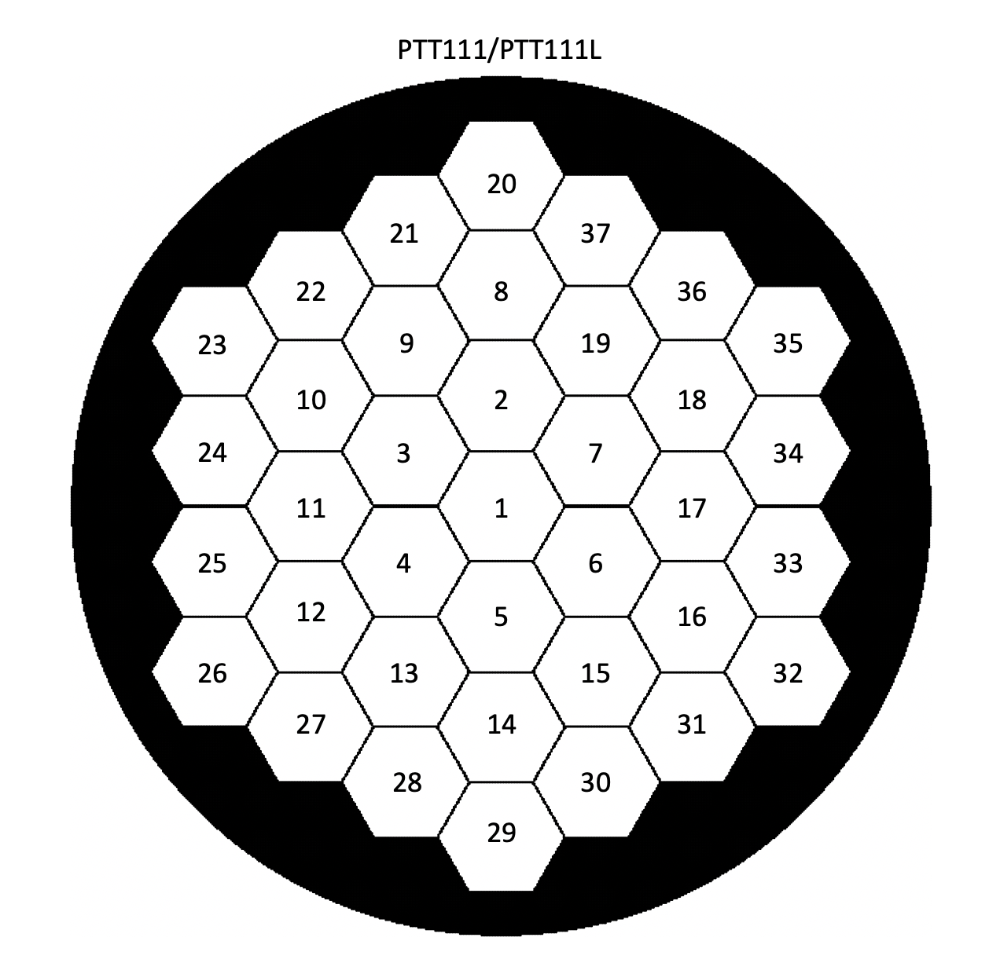

# Iris AO

If you have an Iris AO segmented DM, congratulations! You are one of only a few.


## Segment numbering and input formats
IrisAO has a numeric naming system of the segments in their DMs that puts segment 1 in the center of the DM and continues 
counting in the "up" direction, and then counterclockwise around the DM, as described when looking in the **entrance pupil** 
at the DM. See figures for examples of the PTT111 and PTT489 from IrisAO with their IrisAO numbering. This is also the 
numbering that is used in the IrisAO GUI.




In creating a command for your aperture on a IrisAO segmented DM, you will need to specify the aperture and segments to 
be commanded in the config.ini file (see more on that below). That aperture is what you will be commanding. When loading 
a custom command, the list of PTT values to be loaded will only be for the segments that you wish to move, such that the 
first element in your list will be the first segment to be moved, either the center segment or the first segment (at the 
"top") in the innermost ring of the aperture. `Catkit` follows the same segment numbering convention as Poppy and JWST, 
which numbers segments clockwise when looking at the **entrance pupil**, so we use that orientation in the IrisAO code 
as well. The only time the native IrisAO orientation is used is in the native .PTT### files or .ini files

As an example: if you are projecting a JWST aperture on a IrisAO PTT111/PTT111L, you will only be using a subset of 
segments to build your aperture and will not include the center segment, when passing in a custom command, your command 
will be given in the order as seen in Figure 3.

A common point for confusion is the inclusion or non-inclusion of the center segment in the numbering of the segments. 
As you can see in Fig. 3, we decided to include an extra switch in the IrisAO config setup (see below) which lets you 
toggle between having an active center segment included in your commands or not (e.g. if it is obscured by a mask). This 
will influence the segment numbering: if you include the center segment, it will be indexed by 0. If you do not include 
the center segment, we do not address it at all and the first segment on the "top" of the first ring will be segment 
number 0.


## Input formats

The `catkit` module for the Iris AO expects that you will be passing in one of the following types:

* *.PTT111* file: File format of the command coming out of the IrisAO GUI where the units of the piston, tip, tilt 
values for each segment are um, mrad, mrad respectively.

  Example:

        [GV: 0, 0, 0]
        [MV: 0, 0]
        [MV: 1, 0]
        ...
        [MV: 20, 0]
        [ZV: 1, 0.01, 0, 0]
        [ZV: 2, 0, 0.6, 0]
        ...
        [ZV: 37, 0, 0, 0]

* *.ini* file: File format of command that gets sent to the IrisAO controls where the units of the piston, tip, tilt 
values for each segment are um, mrad, mrad respectively.
* list: A list of tuples with three entries for each segment in the aperture in the following form: [(piston, tip, tilt), ...] (see figure 3 for numbering)

Each of these types has to be handled slightly differently, but never fear, we figured that out for you!

We have also included here some util functions that might come in handy and a module for creating your own custom 
command with POPPY using global coefficients.


## Using the IrisAO controller

As with the other hardware in `catkit`, you can open and close a connection to the Iris AO as a context manager.

Note that `catkit.hardware.iris_ao.segmented_dm_command` and `catkit.hardware.iris_ao.util` pull from CONFIG_INI any time 
you use either one, so you must import your local CONFIG_INI at the top of your module even if you do not explicitly 
use it in that module, this will ensure that you are grabbing the correct parameters for *your* testbed.

### Example:
If putting *only* the flat map on the Iris AO:
```python
from catkit.hardware.iris_ao.segmented_dm_command import load_command

with testbed.segmented_dm() as iris:
iris_command = load_command(None, flat_map=True, dm_config_id='iris_ao')
iris.apply_shape(iris_command)
```


## `config.ini` additions

Note that if you have an Iris AO segmented DM, you will need to add an "iris_ao" section to
your config.ini file. Note that you can name that section whatever you want, but make sure to pass that name in for 
the `dm_config_id` parameter in the `load_command` function (see above example).

Parameters to be included in the the "iris_ao" section of the config.ini file:

Important hardware information:
* `mirror_serial`: The mirror serial number. This corresponds to a .mcf file that *MUST* include the driver serial number under "Smart Driver". See Important Note below.
* `driver_serial`: The driver serial number. This corresponds to a .dcf file.

IrisAO DM information:
* `total_number_of_segments`: The total number of segments in your Iris AO DM hardware (including any non-functioning segments).
* `active_number_of_segments`: (Optional) The number of segments in your specific pupil. This parameter is only necessary if the number of segments used in the aperture is is less than `total_number_of_segments`.
* `active_segment_list`: (Optional) This parameter only needs to be provided if `active_number_of_segments` is less than `total_number_of_segments`. This allows you to center your active pupil off the physical center of the IrisAO. This will be a list of the segment numbers associated with the segments that are used in your pupil. The first segment is the center segment, then the following segments are in order from "up" to the next ring, and then clockwise. Note that "up" for the Iris hardware is in the direction of segment number 20 (see figures 1 and 2). For example, if your pupil is centered on segment 3, and you want to command the center segment, and is only one ring, then active_segment_list = [3, 9, 2, 1, 4, 11, 10]

File locations:
* `custom_flat_file_ini`: The location of the custom flat .ini file for your specific Iris AO DM. Note that this file will likely never be changed by the user.  
* `config_ptt_file`: The location of the ConfigPTT.ini file which is the file that contains whatever command you want to put on the DM as it is periodically updated by the controller.
* `path_to_dm_exe`: The path to the directory that houses the DM_Control.exe file

If using `segmented_dm_command.PoppySegmentedCommand` or `segmented_dm_command.DisplayCommand`, you will need to include the following parameters:
* `flat_to_flat_mm`: The flat side to flat side diameter of each segment in units of mm
* `gap_um`: The size of the gap between segments in units of um
* `dm_ptt_units`: A list of the units for the PTT that are internal to the DM. For IrisAO DMs, this will be: [um, mrad, mrad]
* `include_center_segment`: This a boolean value that will indicate if the aperture you are creating includes the center segment for active control. Examples of when this will be "true": LUVOIR B-like aperture. Examples of when this will be "false": JWST-, Keck-, or LUVOIR A-like apertures.
* `include_outer_ring_corners`: This is a boolean value that will indicate if the corner segments of the outermost ring of your aperture will be used. For example, for LUVIOR A- or B-like apertures, this parameter would be "false", but for a JWST- or Keck-like aperture it would be "true".


---
**Important Note**:

Each segmented DM from Iris AO was calibrated with a specific driver(s). This calibration is captured in the .mcf file. 
Mixing a .mcf file with a .dcf file that *does not match* the driver serial number in the .mcf file could be *fatal* to your DM.

***Make sure the mirror and driver serial numbers are correct in your config.ini file.***

---

### Example:
```ini
[iris_ao]

mirror_serial = 'PWA##-##-##-####'
driver_serial = '########'
total_number_of_segments = 37
active_number_of_segments = 18
active_segment_list = [9, 2, 1, 4, 11, 10, 21, 8, 19, 7, 6, 5, 13, 12, 25, 24, 23, 22]
custom_flat_file_ini = ${optics_lab:local_repo_path}/DM/MirrorControlFiles/CustomFLAT.ini
config_ptt_file = ${optics_lab:local_repo_path}/DM/MirrorControlFiles/ConfigPTT.ini
path_to_dm_exe = ${optics_lab:local_repo_path}Control DM/Code/release
flat_to_flat_mm = 1.4
gap_um = 10
dm_ptt_units = um,mrad,mrad
include_center_segment = false
include_outer_ring_corners = true
```

Note that the code expects to find the `DM_Control.exe` file in `path_to_dm_exe`.


## Update your `testbed_state.py` file
The `iris_ao_controller` will update your `testbed_state.py` file with the current command being applied to the Iris AO. 
In order to allow this, you will need to add the following to your file:

```python
# IrisAO command object currently being applied.
iris_command_object = None
```

When there is no command on the the Iris AO, this variable will be changed back to `None`.

## Update your `testbed.py` file
You also need to make sure you can open and close your Iris AO like other hardware, as a context manager. To do this, 
add the following block of code (edited as necessary for your testbed) to your `testbed.py` file

```python
from catkit.hardware.iris_ao.iris_ao_controller import IrisAoDmController # Iris AO

def segmented_dm_controller():
    """
    Proper way to control the segmented deformable mirror controller. Using this function
    keeps the scripts future-proof. Use the "with" keyword to take advantage of the built-in
    context manager for safely closing the connection. The controller gives you the ability
    to send shapes to the segmented DM.

    :return: An instance of the DeformableMirrorController.py interface.
    """
    config_id = "iris_ao"
    mirror_serial = CONFIG_INI.getint(config_id, "mirror_serial")
    driver_serial = CONFIG_INI.getint(config_id, "driver_serial")
    path_to_dm_exe = CONFIG_INI.get(config_id, "path_to_dm_exe")
    filename_ptt_dm = CONFIG_INI.get(config_id, 'config_ptt_file')

    return IrisAoDmController(config_id=config_id,
                                mirror_serial=mirror_serial,
                                driver_serial=driver_serial,
                                disable_hardware="false",
                                path_to_dm_exe=path_to_dm_exe,
                                filename_ptt_dm=filename_ptt_dm)
  ```
